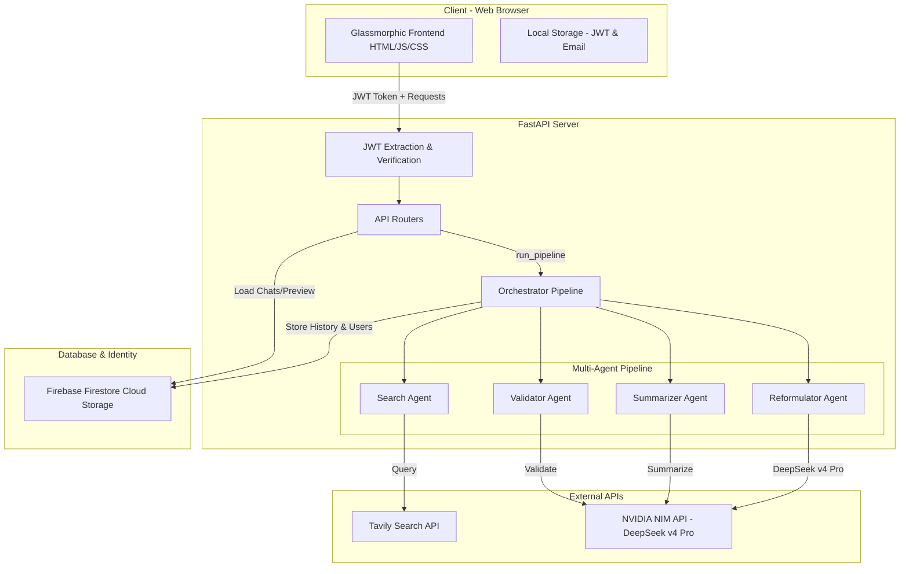

# SearchMind — Complete Project & Architecture Document

Welcome to **SearchMind**, a state-of-the-art, secure, multi-agent AI-powered search application. This document provides an exhaustive, production-grade technical and product breakdown of the SearchMind application as it is currently implemented.

---

## 🌟 Executive Summary

SearchMind solves a primary challenge in modern AI: **grounding Large Language Model (LLM) responses in real-time, validated web data while maintaining context across user sessions.** 

Unlike simple chat interfaces, SearchMind runs a custom four-step agentic pipeline:
1. **Reformulates** user questions utilizing conversation history to ensure high search relevance.
2. **Retrieves** real-time search results using the high-performance Tavily Search API.
3. **Summarizes** the search results into a concise, contextual answer using DeepSeek v4 Pro.
4. **Validates** the summary for factuality, producing a corrected response alongside a confidence rating (High, Medium, Low) and reasoning.

Every session is persisted securely in **Firebase Firestore** with per-user data isolation. Users must register and sign in via a premium glassmorphic interface, and their sessions are authenticated via industry-standard **JSON Web Tokens (JWT)**.

---

## 🏗️ System Architecture

SearchMind is constructed using a high-performance, modern, and lightweight tech stack designed for rapid execution and low latency.



### 1. The Frontend Stack
* **Technologies**: Pure HTML5, Vanilla JavaScript, and Tailwind CSS (delivered via CDN).
* **Layout Design**: Glassmorphism with deep navy-blue/black backgrounds (`#050508` and `#0a0a10`), moving background radial-gradient blobs with custom floating CSS keyframe animations, and subtle glowing purple borders (`#8b5cf6`).
* **Fonts**: `Inter` for standard typography, `JetBrains Mono` for code blocks.
* **Component Framework**: Pure vanilla JS. Chat elements are rendered dynamically and safely using secure HTML escaping to prevent XSS.

### 2. The Backend Stack
* **Framework**: **FastAPI** (Python 3.11+). FastAPI is highly suited for this application because the multi-agent pipeline is heavily network-bound (making concurrent async API calls to Tavily and NVIDIA).
* **Server**: **Uvicorn** ASGI server.
* **Rate Limiting**: Implemented via `slowapi` to protect auth and chat endpoints from denial-of-service (DoS) or abuse.
* **Security Headers**: Standard headers injected into every response (X-Content-Type-Options, X-Frame-Options, Referrer-Policy, and Permissions-Policy) using custom FastAPI middleware.

---

## 🔒 User Authentication & Authorization

Authentication is fully integrated into all core database operations, providing complete isolation between users' histories.

1. **Sign Up**:
   * User provides email and password.
   * Email is converted to lower-case and sanitized.
   * Password must be a minimum of 6 characters.
   * Hashed safely using **bcrypt** (salted) and saved in the Firebase Firestore `users` collection.
2. **Sign In**:
   * Credentials verified using `bcrypt.checkpw()`.
   * Generates a signed **JWT token** containing the `user_id` and `email` payload.
   * The token is signed server-side using the `SECRET_KEY` (HS256).
3. **Session Verification**:
   * Token is stored on the client side in `localStorage`.
   * On page load, `/api/verify` checks token validity.
   * All API requests send the token in the `Authorization: Bearer <token>` header.
   * Backend extracts `user_id` securely to scope database writes and reads.

---

## 🤖 The Multi-Agent Pipeline (The Engine)

The core logic resides in `agents.py` and coordinates four agents asynchronously using **DeepSeek v4 Pro** (via NVIDIA API) and **Tavily**.

### Step 0: Query Reformulator Agent
* **Role**: Takes the user's new message and resolves references (e.g. pronouns like "it", "they", "that") based on the previous conversation history.
* **Prompt Strategy**: Injects up to 10 recent messages from the current session and outputs *only* a single standalone search query.
* **Benefit**: Enables seamless conversational search (e.g., User: "Who is the CEO of Apple?" -> Agent: "Tim Cook" -> User: "How old is he?" -> Reformulated: "What is the age of Tim Cook CEO of Apple?").

### Step 1: Search Agent
* **Role**: Interacts with the **Tavily Search API** using `TavilySearchResults`.
* **Execution**: Async invoke querying for the top 5 most relevant real-time web results.
* **Output**: A structured list of raw web search results, containing: `title`, `url`, and `content`.

### Step 2: Summarizer Agent
* **Role**: Distills the raw Tavily snippets into an informative, structured, and factual summary.
* **Prompt Strategy**: Supplied with the reformulated search query, the original user message, the chronological memory context, and formatted search results. It is instructed to outline a main answer followed by key supporting points, with no preamble.

### Step 3: Validator Agent
* **Role**: Serves as a quality gate to eliminate AI hallucinations and ensure the summary strictly reflects the retrieved search results.
* **Prompt Strategy**: Compares the generated summary against the query. It returns a parsed text response containing:
  * `VALIDATED_SUMMARY`: The final verified (and corrected, if necessary) summary.
  * `CONFIDENCE`: The confidence level (`high`, `medium`, or `low`).
  * `REASON`: A single-sentence justification for the assigned confidence.

---

## 💾 Memory & Database Storage (Firebase Firestore)

SearchMind replaced local ChromaDB with **Firebase Firestore** to achieve true cloud-native state persistence. 

### Firestore Database Schema

#### Collection: `users`
* Document ID: `email` (lowercase, e.g. `you@example.com`)
* Fields:
  * `user_id`: String (hex token)
  * `password_hash`: String (bcrypt hash)
  * `created_at`: String (ISO-8601 UTC timestamp)

#### Collection: `chat_messages`
* Document ID: `message_id` (random UUID)
* Fields:
  * `session_id`: String (groups messages by conversation)
  * `user_id`: String (binds the message to the authenticated user)
  * `role`: String (`user` or `assistant`)
  * `content`: String (raw message text or validated summary)
  * `timestamp`: String (ISO-8601 UTC timestamp)
  * `sources`: String (JSON-stringified list of `{title, url}` dictionaries)
  * `confidence`: String (`high`, `medium`, `low`, or empty for users)

### Context Retrieval Strategy
Firestore does not support vector similarity queries natively without heavy integrations. Instead, `get_memory_context()` retrieves the **last 5 chronological messages** of the current session as context for the Summarizer Agent. This guarantees immediate chronological alignment and context awareness with ultra-low latency.

---

## 🔄 API Endpoint Documentation

All routes (except `/`, `/api/login`, and `/api/register`) require an `Authorization` header with a valid Bearer JWT.

| Method | Route | Authentication | Description |
| :--- | :--- | :--- | :--- |
| **GET** | `/` | No | Serves the single-page application (`index.html`). |
| **POST** | `/api/register` | No (Rate Limited: 3/min) | Registers a new user. Expects `email` and `password`. Returns JWT and user details. |
| **POST** | `/api/login` | No (Rate Limited: 5/min) | Auths a user. Expects `email` and `password`. Returns JWT. |
| **GET** | `/api/verify` | Yes | Validates current JWT. |
| **POST** | `/api/chat` | Yes (Rate Limited: 20/min) | Runs full 4-agent pipeline. Expects `message` and `session_id`. Returns summary, sources, confidence, and session ID. |
| **GET** | `/api/history` | Yes | Retrieves list of all user sessions with preview text (truncated first message) and timestamp, sorted newest first. |
| **GET** | `/api/history/{session_id}` | Yes | Retrieves all messages inside a specific session, sorted chronologically. |
| **POST** | `/api/new-session` | Yes | Generates and registers a new unique UUID `session_id`. |

---

## 🎨 UI/UX Component Specifications

The single-page web app is fully responsive and utilizes rich aesthetics:
* **Background Blobs**: Three fixed, floating background divs with large radial gradients blur out behind the application, slowly translating across the screen via non-blocking CSS animations.
* **Sidebar History**: Contains a "New Chat" button, user profile info, and a list of conversations. Conversations display a preview of the first message (truncated to 40 characters).
* **Response Cards**: Styled with an elevated background (`rgba(255,255,255,0.02)`) and neon confidence badges:
  * **High Confidence**: Green border/text (`#10b981`) + "✅ High Confidence"
  * **Medium Confidence**: Amber border/text (`#f59e0b`) + "⚠️ Medium Confidence"
  * **Low Confidence**: Red border/text (`#ef4444`) + "❌ Low Confidence"
* **Sources Section**: Formatted as horizontal-scrolling chip elements containing the website favicon (automatically resolved via Google Favicon service) and the clean domain name.
* **Typing Indicator**: Fades in a glassmorphic loader with three bouncing purple dots. The label updates dynamically based on backend stages using timed intervals:
  1. *0 - 2.5s*: "🔍 Searching the web..."
  2. *2.5s - 5s*: "📝 Summarizing results..."
  3. *5s+*: "✅ Validating answer..."

---

## 🛠️ Environment Configuration & Deployment

### Required Environment Variables (.env)
```bash
TAVILY_API_KEY=tvly-xxxxxxxxxxxxxxxxxxxx
NVIDIA_API_KEY=nvapi-xxxxxxxxxxxxxxxxxxxx
SECRET_KEY=xxxxxxxxxxxxxxxxxxxxxxxxxxxxxxxxxxxxxxxx (Minimum 32 hex chars)
# Local development only:
FIREBASE_CREDENTIALS_PATH=firebase-service-account.json.json
# Production deployment (e.g., Render / HF Spaces):
FIREBASE_CREDENTIALS_JSON=eyJhY2NvdW50X3R5cGUiOiAic2VydmljZV9hY2NvdW50Ii... (Base64-encoded credential JSON)
```

### Production Hosting on Render
The application is ready to deploy directly as a web service:
* **Build Command**: `pip install -r requirements.txt`
* **Start Command**: `uvicorn main:app --host 0.0.0.0 --port $PORT`
* **Storage**: No persistent disk mounts or configurations are required on Render anymore! The complete application state lives inside Firestore, rendering it entirely stateless and highly reliable.
